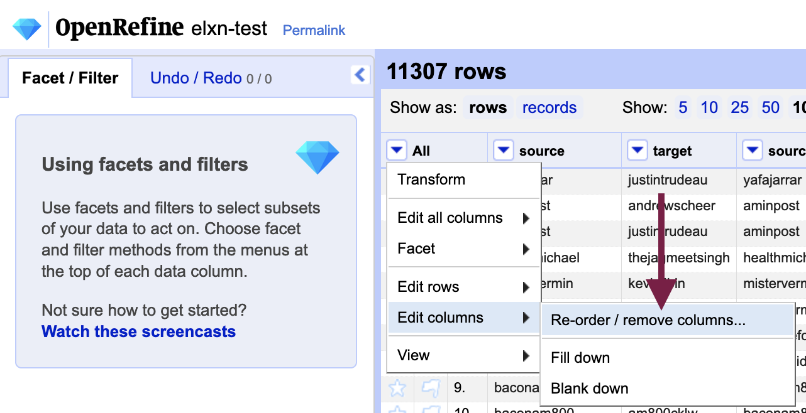
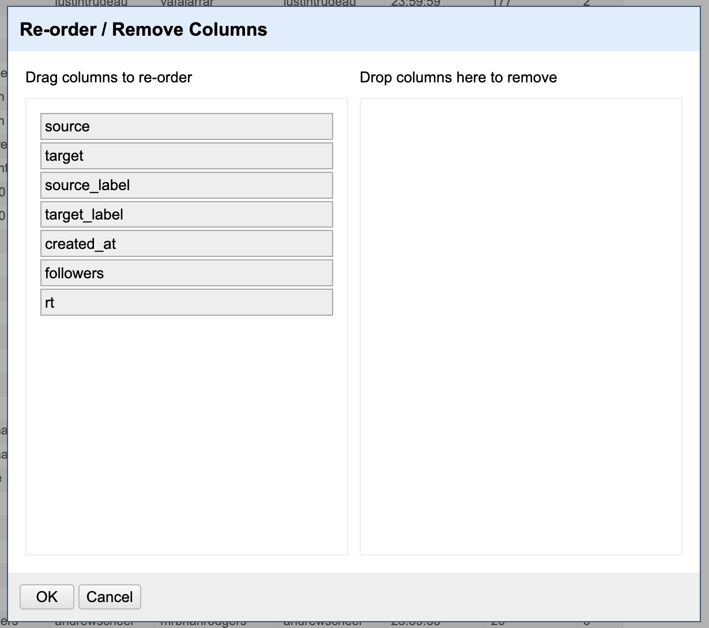
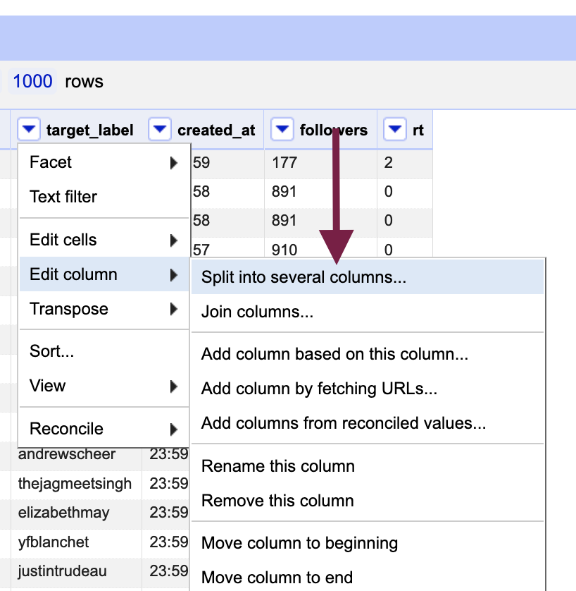
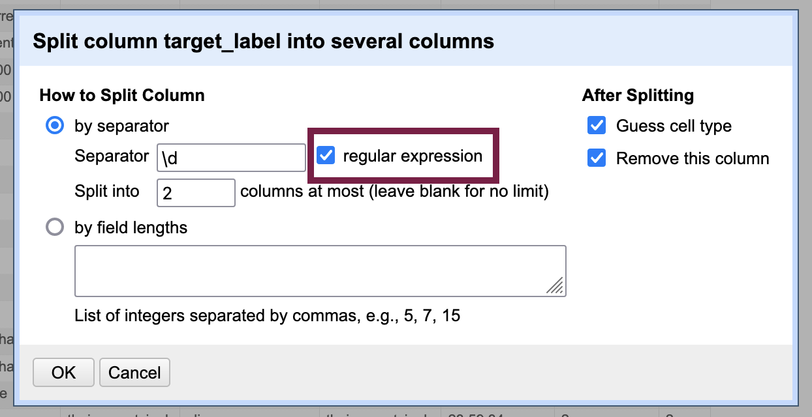
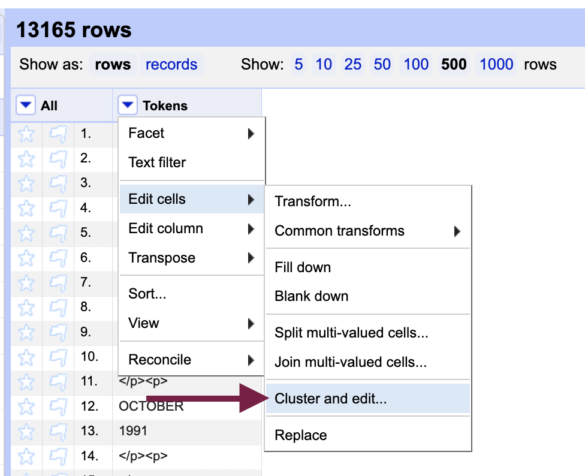
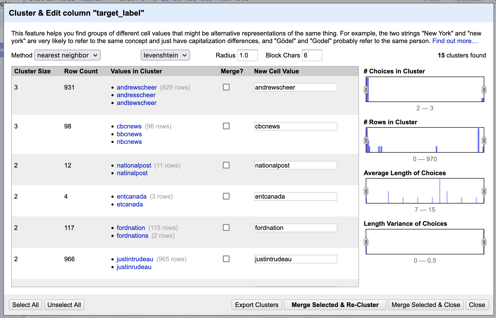
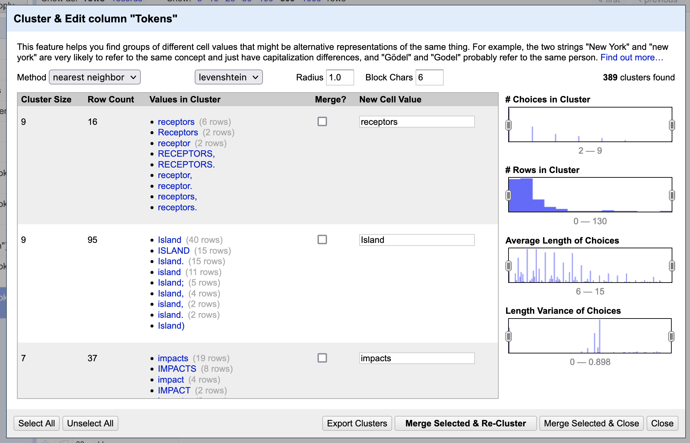
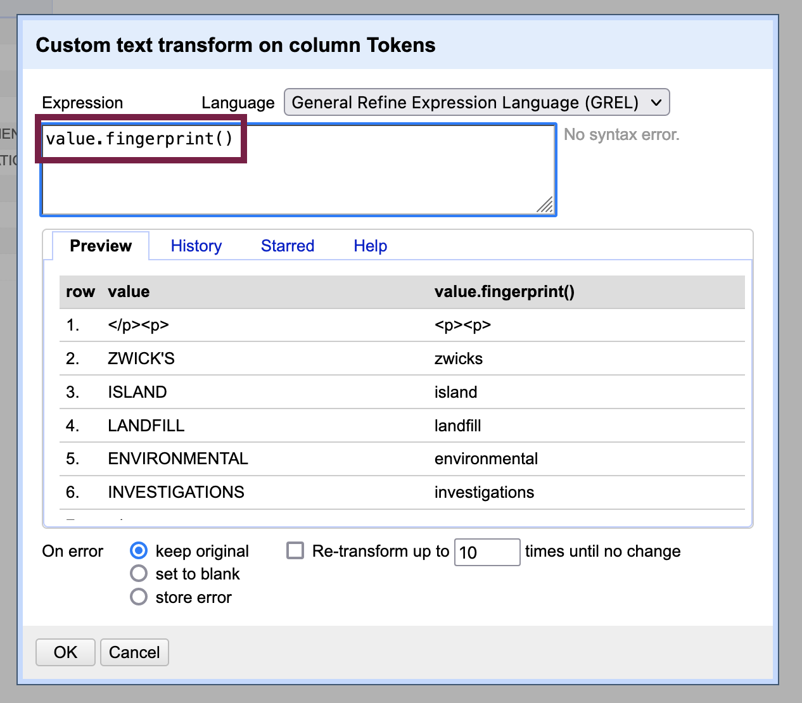
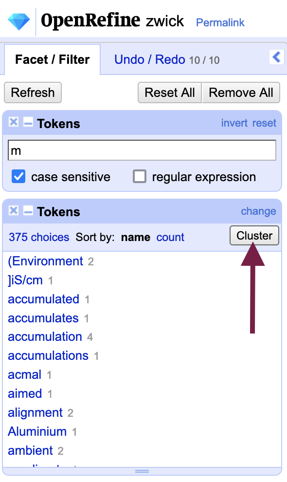

# Pre-Processing Born-Digital Texts

Not all pre-processing of text data involves correcting OCR errors: working with text created in a digital format presents an entirely different set of challenges.

Analyzing born-digital text data - extracted from PDFs, websites, social media platforms and so on - may instead require you to exclude dozens or even hundreds of other data points, change encodings, convert HTML entities, normalize values and more.

Although writing a program in Python or R will accomplish some tasks more efficiently, OpenRefine is still incredibly useful when pre-processing born-digital text data as well. OpenRefine accepts JSON files, a format that many application programming interfaces (APIs) output, in addition to line-based text files that we have already worked with. Much of what you learned in the lesson on pre-processing digitized texts will have applications for born-digital text data, like splitting cells and isolating rows to limit the scope of your transformations.

A few additional features of OpenRefine may assist your pre-processing of born-digital text data:

## Removing columns

If your data source outputs fields (features) that are not relevant to your analysis, you can remove columns using the "All" column menu: `Edit columns` > `Reorder / remove columns`.

You can drag rows over to the "Drop columns here remove" area to remove them from the dataset. Because the action must be performed on each of the columns to remove, a programmatic approach is likely more efficient if you have a large number of rows to remove.

## Transpose rows across columns

Just as we can remove columns, we can also add them based on existing cell contents; for example, objects with multiple properties or strings containing more than one value (e.g. LastName, FirstName).

Go to the column menu of the column you would like to split: `Edit columns` > `Split into several columns...`.

Choose a column separator on which to split the column (e.g. comma); you can use regular expressions as well, as depicted in the image below. Leave the "Split into ______ columns at most" blank if you are not sure how many times the separator will occur in the cells - you can always undo if you unexpected end up with dozens of rows!

The above screenshot demonstrates using the `\d` regular expression to create a new column every time it encounters a digit (\[0-9]) in the cell.

## Clustering similar cells

<iframe id="kmsembed-1_izyqu34i" width="608" height="402" src="https://www.macvideo.ca/embed/secure/iframe/entryId/1_izyqu34i/uiConfId/39241881" class="kmsembed" allowfullscreen webkitallowfullscreen mozAllowFullScreen allow="autoplay *; fullscreen *; encrypted-media *" referrerPolicy="no-referrer-when-downgrade" sandbox="allow-forms allow-same-origin allow-scripts allow-top-navigation allow-pointer-lock allow-popups allow-modals allow-orientation-lock allow-popups-to-escape-sandbox allow-presentation allow-top-navigation-by-user-activation" frameborder="0" title="Kaltura Player" style="position:absolute;top:0;left:0;width:100%;height:100%"></iframe>

 
Sometimes (human-made) spelling errors can interfere with data analysis as well. Clustering is useful when there are small variances between similar values, such as typos, differences in case or punctuation. OpenRefine will treat "Ammonia" and "ammonia" as distinct values, for example.

You can access clustering from the column menu: `Edit cells` > `Cluster and edit...`.

OpenRefine will present you with grouped sets of very similar cell contents. You can choose to merge them to normalize the values. You can also supply a new value in the "New Cell Value" column to the right of the cluster. The screenshot below shows slight misspellings of Twitter account names, which would affect the ability to get an accurate count of them.

In the screenshot, the levenshtein clustering method is used. You may want to experiment with other methods, such as the "metaphone3" phoentic algorithm (accessible from the keying function drop-down menu when "key collision" is set as the method) which groups cells together with words that sound alike. You can explore other methods in the [Clustering in Depth](https://github.com/OpenRefine/OpenRefine/wiki/Clustering-In-Depth) resource created by Owen Stephens. 

### Using clustering for post-OCR correction

Generally, there tend to be too many clusters in tokenized, post-OCR texts to make merging a viable strategy to correct errors. Numerous distracting clusters will be returned: tokens that are correctly spelled but may include punctuation in the cell, for example. 

If you do not intend to reconstitute your text as a human-readable document - that is, you just want to output a bag of words for computational analysis - you can, of course, remove punctuation and change all letters to the same case to have more success with finding genuine OCR errors through clustering. To remove punctuation and make the case consistent, do a text transform in GREL using the `value.fingerprint()` operation to both remove punctuation and change all letters to lower case. But you may find now that you get a lot of clusters that contain different words and not misspellings of the same word, or false positives. 

You can further narrow down the number of clusters by using filters and facets - OpenRefine allows you to open the clustering menu directly from the facet area.

Next -> [Behind the Interface](behind.html)

