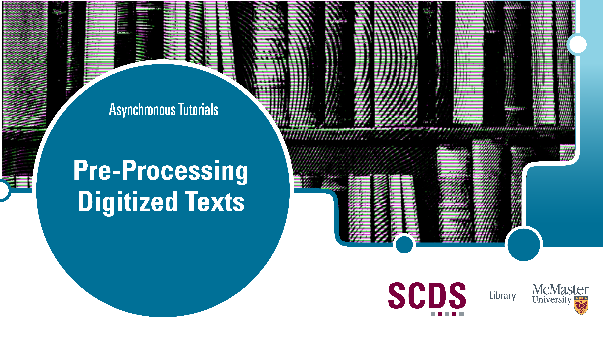

# Pre-Processing Digitized Texts

***Pre-Processing Digitized Texts* belongs to a series of workshops on computational text analysis.**

We underestimate our abilities as humans to make sense of orthographic errors and alternative spellings like *thcn* or *shew*. Machines are less capable of making these inferences, meaning that [OCR](https://en.wikipedia.org/wiki/Optical_character_recognition) text output must often be corrected in the pre-processing stage of the textual analysis pipeline to render it legible to computational methods. 

In this workshop, we’ll use several approaches to correcting errors in the OCR text output and discuss when to use them. We’ll also introduce the concepts of initial data analysis (IDA) and data provenance, as well as exploring how some techniques used for correcting OCR errors in digitized texts can also be extended to pre-processing born-digital texts.

## Prerequisites
* Basic computer literacy (creating and working with different file types, navigating interfaces, using shortcut keys and so on)

## Learning Objectives
By the end of this workshop, you will be able to:
* Perform initial data analysis on OCR text output
* Explain the importance of data provenance 
* Apply computational techniques to correct common OCR errors
* Identify an appropriate data pre-processing approach

## Duration
Going through the workshop from start to finish (and you need not do so necessarily!) will take you approximately 2 to 3 hours to complete, depending on your familiarity with OpenRefine and/or Python and whether you are working with your own dataset alongside the sample corpus. 

## Land Acknowledgement
McMaster University is situated in Ohròn:wakon which is the traditional territories of the Erie, Neutral, Huron-Wendat, Haudenosaunee and Mississaugas. This land is covered by the “Dish With One Spoon Wampum Belt Covenant”, an agreement between the Haudenosaunee confederacy and Anishinaabe nations to ensure those who live here take only what they need, leave enough in the dish for others, and keep the dish clean. This land is also covered by the Between the Lakes Treaty of 1792 and is very close to the 1784 Haldimand Treaty, which holds the land six miles to each side of the Grand River as a tract for Six Nations, which is currently not being honored. 

Many of us at the Sherman Centre took the First Nations' Information Governance Centre's OCAP course this past year which stands for Ownership, Control, Access, and Possession. We encourage you to learn [more about OCAP](https://fnigc.ca/ocap-training/take-the-course/) and Indigenous data management practices more broadly, including the [OCAS principles](https://u.mcmaster.ca/ocas-framework) endorsed by the Manitoba Métis Federation, the principles of [Inuit Qaujimajatuqangit](https://doi.org/10.1139/as-2020-0015), ᐃᓄᐃᑦ ᑕᐱᕇᑦ ᑲᓇᑕᒥ (Inuit Tapiriit Kanatami) [National Inuit Strategy on Research](https://www.itk.ca/national-strategy-on-research-launched/), and Global Indigenous Data Alliance’s [CARE principles](https://www.gida-global.org/care). 
