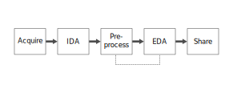

# An Overview of the Textual Data Analysis Workflow

When performing textual analysis through computational means, we are working with texts as data. Texts, in their unstructured form - and especially if they have been digitized as an image from a physical source - can only be operated upon by a computer in limited ways. Datafied, or transformed into data that is amenable to the tasks and operations we can perform with a computer, allows for new approaches to understanding texts. 

As [Thomas Padilla explains](https://labs.loc.gov/static/labs/work/reports/tpadilla_OnaCollectionsasDataImperative_final.pdf), "if the notion of a single digitized text is shifted from a surrogate of a bound paper object to consider the possibility latent in a form that is computationally processable at the level of thousands or even  millions of texts, a move is made toward meaning making that engages affordances unique to data" (Padilla, 1). 

We will become more familiar with what is involved in transforming texts into data later in the lesson, but it is important to note that each transformation involves a layer of interpretation. And each layer of interpretation opens up the possibility for different forms of bias - such as a system trained only on texts written by authors of European descent - to enter in.

The textual data analysis workflow below describes the stages of taking textual data from its source - be it a scanned document or born-digital data retrieved from an application programming interface (API) - to an output from a computational process. It is a simiplified overview; each stage can be articulated as a series of tasks that will vary depending on the project.

Acquisition (Input)
: The text corpus is assembled in a datafied form that can be operated upon computationally. This may involve running optical character recognition (OCR) on scanned physical texts or downloading from an API.

Initial data analysis (IDA)
: In the initial data analysis stage, we are attending to potential errors in the data for the most part; that is, to identify features of the data that may impact how we work with it and to inform the steps of the pre-processing stage. Numerous tools exist to support IDA, depending on the type of data you are working with and the kinds of errors you are trying to find. In the IDA step of the current lesson, we use a ubiquitous word processing software to perform IDA (with a little help from a macro). 

Pre-processing
: The pre-processing stage readies the data for exploratory data analysis by correcting errors or otherwise preparing the data for use with EDA tools. With digitized (scanned) physical documents, pre-processing is typically focused on correcting errors made during OCR. With born-digital texts - such as tweets scraped from Twitter's API - pre-processing may involve converting HTML entities to human-readable symbols or changing the text encoding. Take care in the pre-processing stage not to introduce *new* errors into the data, of course!

Exporatory data analysis (EDA)
: In the second round of data analysis, we try to make sense of the data. Exploratory data analysis allows you to test inferences, highlights important features of the data and helps to refine your research question. It is also possible to surface new errors in the data through, which can take you back to the pre-processing stage. You may find yourself looping between the EDA and pre-processing stages a few times as you get more and more acquainted with your dataset.

Share (Output)
: Once you have analyzed to the data in the EDA stage, the next stage is to communicating your findings. The output can take the form of a processed dataset, visualization, interactive website and so on. 

In the current lesson, we will focus on the second and third stages – initial data analysis and pre-processing - to prepare the text for EDA, which will be the focus of the lessons that follow. Pre-processing is unglamorous work, but critically important to ensuring that your EDA stage is not ridden with noisy errors. Pre-processing is also time-consuming relative to the rest of the workflow - it can amount to 70% or 80% of the total labour involved - so remember to account for it when planning a computational text analysis project!

Each stage of the workflow that involves a data transformation holds the potential to introduce errors that often have consequences for later stages of the workflow, which may not become evident until you actually arrive at that stage. It is therefore important to document the transformations you perform so that errors can be traced back and corrected. This documentation also contributes to the record of its origins, or its **data provenance**.

## Data Provenance

Anyone who has worked with archival materials before (which we may assume encompasses some of the lesson's intended audience!) is likely familiar with the concept of provenance, referring to the origins of something (e.g. a collection or archival fonds). Data provenance, then, traces the origins and lineage of your dataset throughout its lifecycle including:
* where you got the data from
* what transformations your performed upon the data
* what steps you took during your analysis of the data and the thinking behind it

Documenting the provenance of your data helps to establish the accuracy, reliability and [authenticity of your results](https://www.ands.org.au/working-with-data/publishing-and-reusing-data/data-provenance) and also allows you to trace back and correct errors when you discover them later in the textual data analysis workflow. It is also good practice to make well-named (i.e. easy to identify from the filename alone) copies of the dataset as you move through the stages of the workflow to avoid unintentionally and irreversibly transforming the data.

If you are using a tool like OpenRefine for pre-processing, some of the provenance documentation can be automated; as we will see in "[Exporting the Data](lessons/3-output.html)," OpenRefine keeps track of every operation you perform which can be exported in JSON format.

A more detailed discussion of data provenance is outside of the scope of the current lesson, but if you wish to pursue the topic further, "[Datasheets for Datasets](https://arxiv.org/abs/1803.09010)" by Gebru et al. offers a thorough introduction - and a thoughtful approach - to the topic. For other provenance tools, you can explore Paolo Missier's "[Provenance Standards](http://homepages.cs.ncl.ac.uk/paolo.missier/doc/Provenance-standards.pdf)" and the [Provenance Tools page](https://projects.iq.harvard.edu/provenance-at-harvard/tools) created by the Provenance@Harvard group at Harvard University.