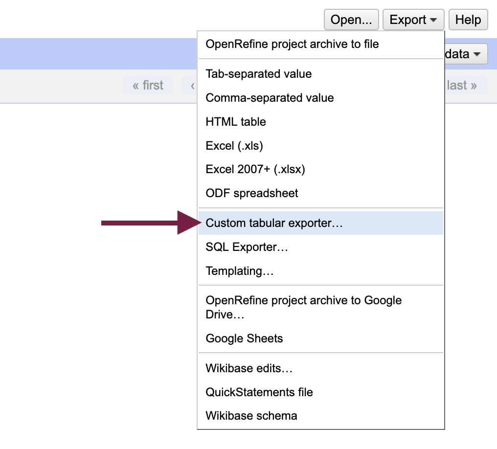
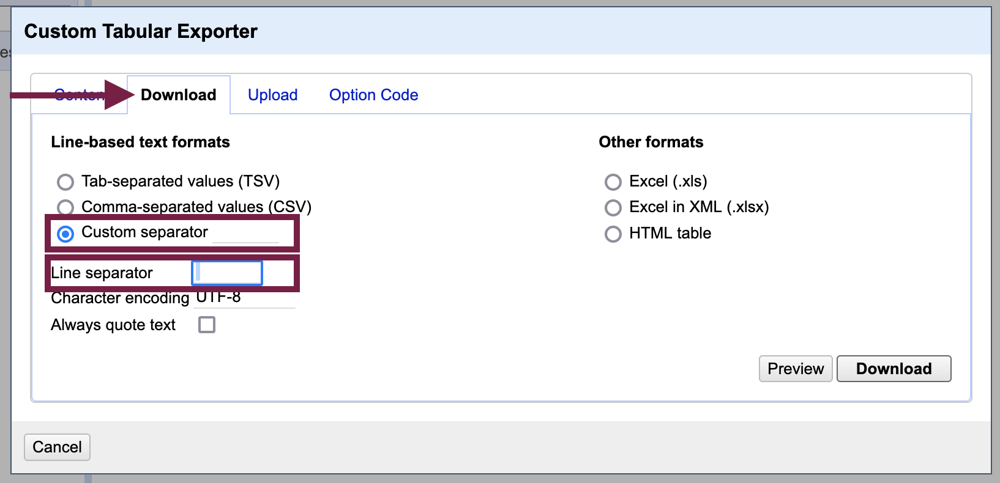
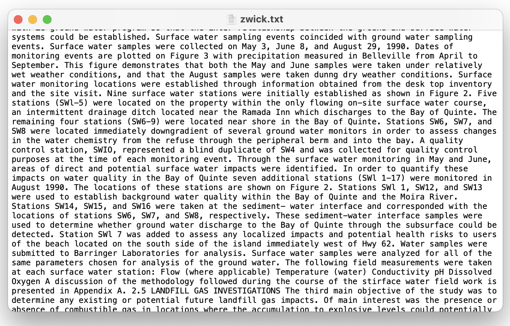
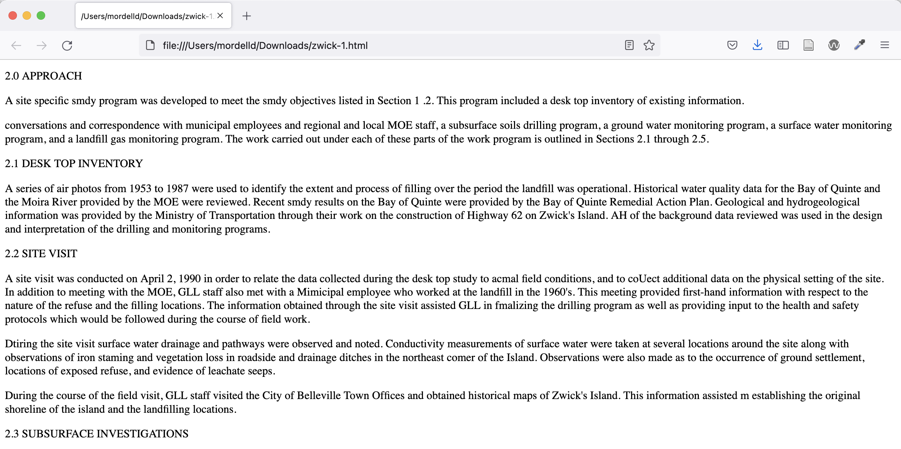
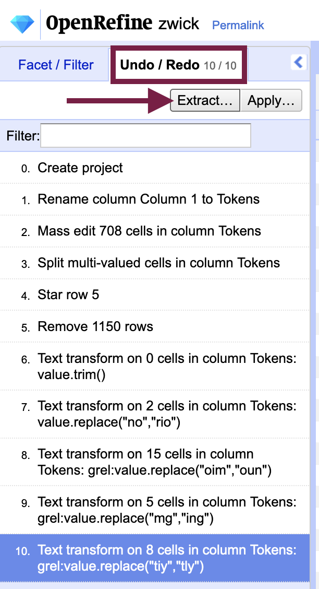
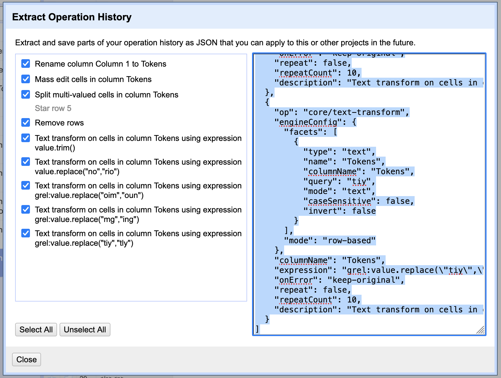
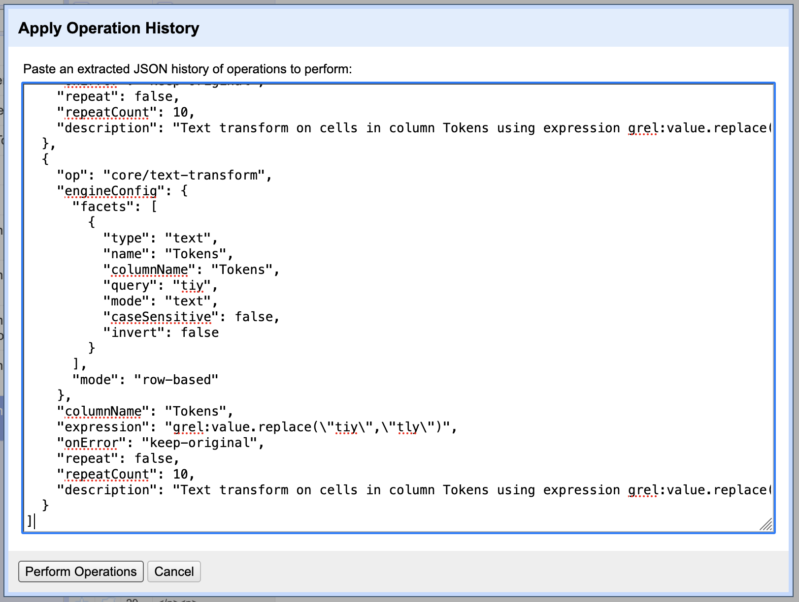

{: .no_toc }
# 4. Exporting Your Transformed Data

## 4.1 - Reconstituting your document {#step1}

The following video demonstrates each of the steps outlined below in text.
<iframe id="kmsembed-1_ynl6f1t7" width="100%" height="416" src="https://www.macvideo.ca/embed/secure/iframe/entryId/1_ynl6f1t7/uiConfId/39241881" class="kmsembed" allowfullscreen webkitallowfullscreen mozAllowFullScreen allow="autoplay *; fullscreen *; encrypted-media *" referrerPolicy="no-referrer-when-downgrade" sandbox="allow-forms allow-same-origin allow-scripts allow-top-navigation allow-pointer-lock allow-popups allow-modals allow-orientation-lock allow-popups-to-escape-sandbox allow-presentation allow-top-navigation-by-user-activation" frameborder="0" title="Kaltura Player"></iframe>

Unless you must achieve 100% accuracy in the text, consider setting a threshold for with your OCR error correction efforts - *n* hours or *x%* accuracy. If going by accuracy, keep in mind that machine learning approaches are not that reliable! [A recent paper by Soper et al.](https://aclanthology.org/2021.wnut-1.31.pdf) reported that their tuning of the BART language model led to about a 30% improvement in text accuracy for monographs (where the BART model, untuned, led to a *decrease* in text accuracy). 

Once finished, you will need to export your data for use outside of OpenRefine. OpenRefine is designed to work with tabular data - data stored in tables. To export our data in a text format that we can use for computational text analysis, we have to tweak some settings...

Before exporting the data, remove any active filters or facets - the current number of rows is what will be exported. The `Export` menu is found at the top right of the screen; from it, select `Custom tabular exporter...` which will open up a dialog box with export options. 

Select the "Download" tab and:

1. Under "Line-based text formats," choose "Custom Separator" and in the field next to it, delete the contents ("\t") and hit the spacebar once
2. Next to "Line separator," delete the field contents and hit the spacebar once
3. Download the file

The output will be a text file (.txt extension). If you did not put in a placeholder to maintain the paragraph structure, the text will be formatted as one long block. For the purposes of computational text analysis, the lack of paragraphs should not affect your work in most cases.

If the paragraph structure of the document does matter for your purposes and you used paragraph placeholders as described in "[Optional: Create paragraph placeholders](or-prep#optional-create-paragraph-placeholders)," you can now do a find-and-replace of the placeholder with a newline character in a text editor. Alternatively, if you used paragraph or `
` HTML tags, you can simply change the file extension to .html and the paragraph structure will be present when you open the document in a web browser.

## 4.2 - Extracting the pre-processing steps from OpenRefine {#step2}
<iframe id="kmsembed-1_1aa1yvgs" width="100%" height="416" src="https://www.macvideo.ca/embed/secure/iframe/entryId/1_1aa1yvgs/uiConfId/39241881" class="kmsembed" allowfullscreen webkitallowfullscreen mozAllowFullScreen allow="autoplay *; fullscreen *; encrypted-media *" referrerPolicy="no-referrer-when-downgrade" sandbox="allow-forms allow-same-origin allow-scripts allow-top-navigation allow-pointer-lock allow-popups allow-modals allow-orientation-lock allow-popups-to-escape-sandbox allow-presentation allow-top-navigation-by-user-activation" frameborder="0" title="Kaltura Player"></iframe>

One of the best features in OpenRefine for OCR error correction is the history it keeps of your actions in the "Undo / Redo" tab on the left-side pane (where filters and facets are displayed). Not only is OpenRefine's documentation of your data transformations critical for data provenance, you can also create a program from them that you can run again and again.

From the "Undo / Redo" tab, select `Extract...` to open a dialog box with all of the actions you performed rendered in JSON format. You can copy the text to a new document for data provenance purposes. If you wish to run the program again, you can deselect steps that you will not need to repeat before copying the text.

To run the program of steps you previously performed in OpenRefine again, use the `Apply...` button next to `Extract` and paste the JSON data to the "Apply Operation History" dialog box.

You may find the ability to run the steps again helpful if you are working parts of a long document or the OCR errors are similar from one document to another. 

You could also perform your OCR post-correction on the [error list you created in the initial data analysis stage](initial-data-analysis#step3) and then apply the program to full document without the need to tokenize it (note that some RegEx transformations could be affected, however).

## Key Points / Summary
* Your text data output will not preserve its paragraph structure if you didn't make paragraph placeholders.
* For the purposes of computational text analysis, the lack of paragraphs should not affect your work in most cases.

## Congratulations!

You have reached the end of the hands-on lesson component of the workshop. Read on, however, if you would like to learn more about OCR error correction in Python, pre-processing born-digital texts, and why the use of terms like "cleaning" or "extracting" in relation to data is loaded. 
