# Correcting OCR Errors with OpenRefine: Preparing the Data

## OpenRefine step 1: Import your texts

<iframe id="kmsembed-1_oa7u1zml" width="608" height="402" src="https://www.macvideo.ca/embed/secure/iframe/entryId/1_oa7u1zml/uiConfId/39241881" class="kmsembed" allowfullscreen webkitallowfullscreen mozAllowFullScreen allow="autoplay *; fullscreen *; encrypted-media *" referrerPolicy="no-referrer-when-downgrade" sandbox="allow-forms allow-same-origin allow-scripts allow-top-navigation allow-pointer-lock allow-popups allow-modals allow-orientation-lock allow-popups-to-escape-sandbox allow-presentation allow-top-navigation-by-user-activation" frameborder="0" title="Kaltura Player" style="position:absolute;top:0;left:0;width:100%;height:100%"></iframe>

Begin by opening OpenRefine; it will open in your default web browser and prompt you to create a project. Use the `Browse...` button to locate your text files. OpenRefine will allow you to upload .txt files, treating each line of the text document as a new row.

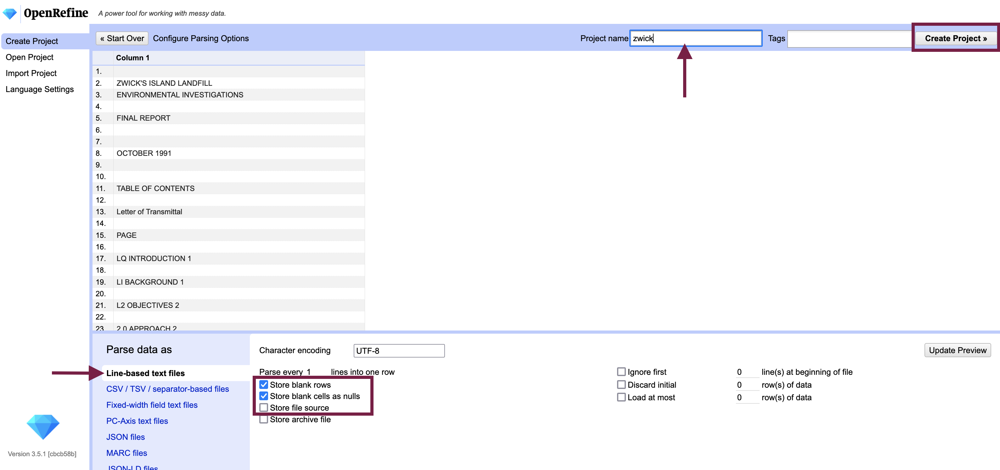

Import options:
* Store blank rows - leave checked if you want to preserve the paragraph structure of the document; otherwise uncheck*
* Store file source (if using multiple documents) - if you wish to "reconstitute" your documents later (i.e. output them as separate documents), leave checked 

\**OpenRefine has a ceiling on the number of rows you can work with (~1,000,000) so you may wish to conserve resources by excluding blank rows.*

Give your project a name and `Create Project >>` to open your document(s) in OpenRefine.

## OpenRefine step 2: Initial Data Analysis

Although you will already have done much of your initial data analysis in another tool, you will often learn something new about how your text files are structured when you upload them to OpenRefine - e.g. where line breaks occur or how characters might be interpreted differently in OpenRefine from the text editor you used for any earlier initial data analysis. There can be consequences for the pre-processing steps you undertake, so take some time to review the data in OpenRefine before performing any transformations. You may discover that you need to do some pre-processing tasks with the .txt files in a text editor before re-uploading them to OpenRefine.

For example, longer words in newspapers and other justified typeset documents will sometimes be split over two lines separated with a hyphen or dash - it is usually easier to reconnect them in a text editor like TextEdit or Notepad++ before uploading to OpenRefine using a find-and-replace function in the editor (make a copy of your data first, as it is a destructive edit).

Once you have performed any additional (pre-)pre-processing steps outside of OpenRefine and re-uploaded your text file(s), rename the column with the contents of your text "Tokens" by visiting the column menu - which can be accessed through the small downward arrow to the left of the column - and selecting `Edit column` > `Rename`.

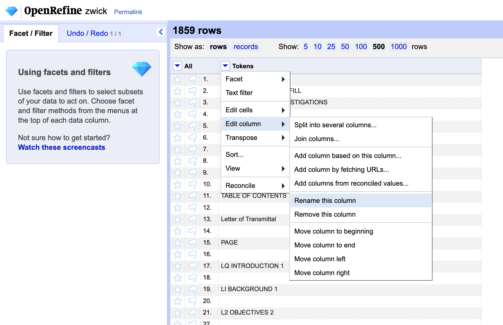

### Optional: Create paragraph placeholders

<iframe id="kmsembed-1_vzcfv4kl" width="608" height="402" src="https://www.macvideo.ca/embed/secure/iframe/entryId/1_vzcfv4kl/uiConfId/39241881" class="kmsembed" allowfullscreen webkitallowfullscreen mozAllowFullScreen allow="autoplay *; fullscreen *; encrypted-media *" referrerPolicy="no-referrer-when-downgrade" sandbox="allow-forms allow-same-origin allow-scripts allow-top-navigation allow-pointer-lock allow-popups allow-modals allow-orientation-lock allow-popups-to-escape-sandbox allow-presentation allow-top-navigation-by-user-activation" frameborder="0" title="Kaltura Player" style="position:absolute;top:0;left:0;width:100%;height:100%"></iframe>

If the original paragraph structure of the document is significant your intended use of the text data (e.g. for readability, stylometric analysis), there is another step that must be performed before tokenizing the data. We can maintain the paragraph structure of a document in the output from our error correction in OpenRefine, but it takes an additional step early on in the workflow - before we break the sentences into tokens in the next step.

Provided you left "Store blank rows" checked when importing the document, each blank - or null - row in the data represents a line break. Replace the null rows with a placeholder character that you can later use to replace with a new line.

Create a facet - or grouping of rows with the same contents - that contains all of the null rows by going back to the dropdown menu, `Facet` > `Customized facets` > `Facet by null`. 

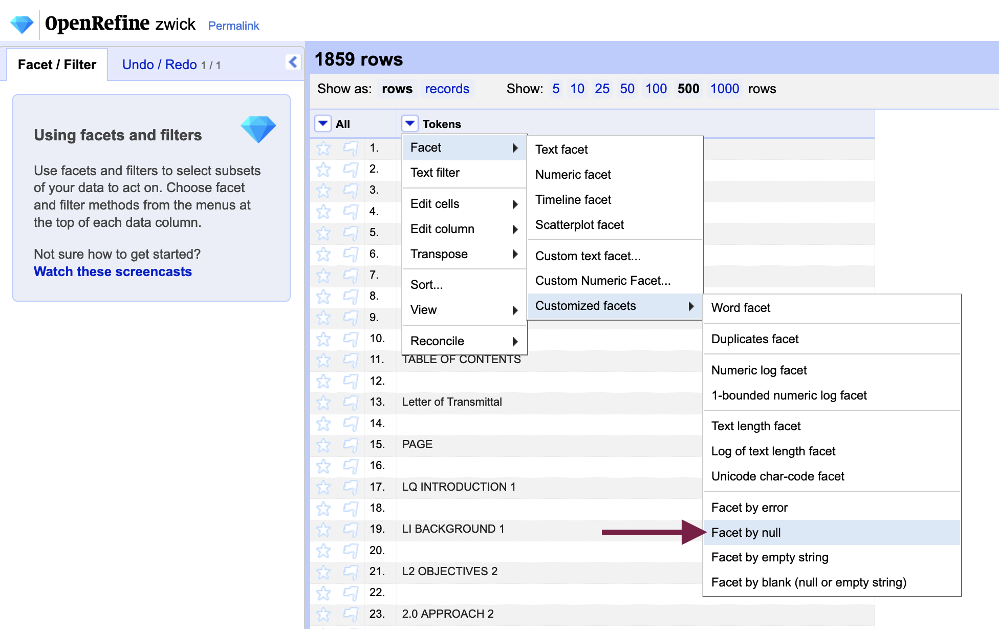

Filter the rows to show null values only by selecting "Include" from the facet menu next to "True" (i.e. those rows that contain null values). With the null values isolated, we can now perform a replace action to fill each blank row with a placeholder character.

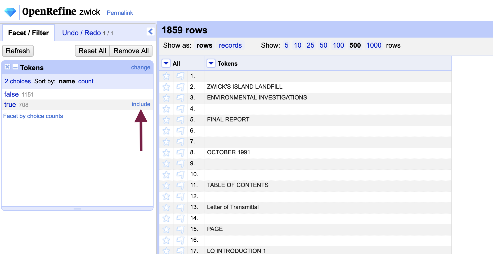

Hover over any of the rows and you will notice that an "Edit" message appears, allowing you to edit individual cells. In the cell that you edit, enter a placeholder character and select the "Apply to All Identical Cells" (`ctrl` / `cmd` + `enter`) option to transform all null rows.

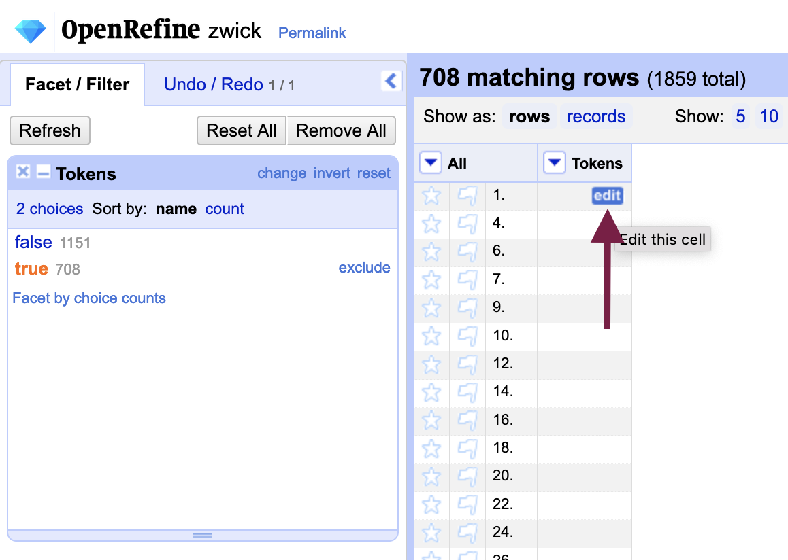

Choose a placeholder character that does not exist anywhere else in the text, as you will be performing a find-and-replace action later to substitute a line break for the placeholder. We recommend using the HTML tag for paragraph, or `

`, which will preserve the paragraph structure without any additional actions if the text is output to HTML. Copy the code exactly as it is below, and paste in the cell you are editing:

`

`

(The order of the markup tags is reversed so that each blank row closes the previous paragraph tag and opens a new one around the content that follows.)

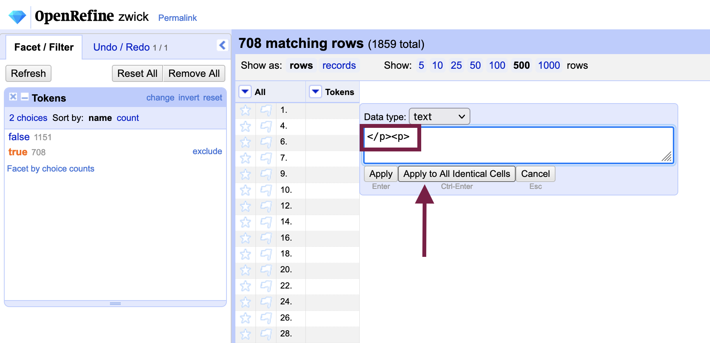

Once the null rows have been transformed, they should no longer be visible as their value are no longer null. Remove the facet by closing it, and all rows will return. As we tokenize the data in the next step, the placeholders will be treated as another token and preserved for later use to restored the paragraph structure of the text.

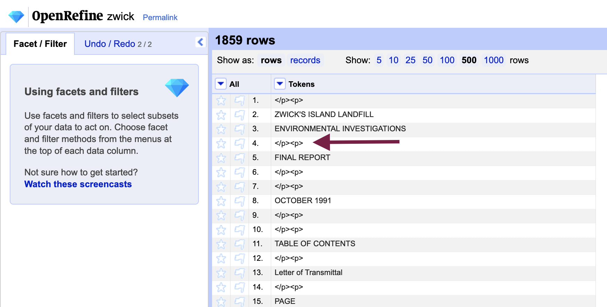

If you change your mind about the placeholder character or otherwise notice that you have made an error, you can easily undo it by going to the "Undo / Redo" tab in the left-side pane of the interface. You will notice that a full history of all of the steps you have performed is preserved there, which we will return to in "[Extracting the pre-processing steps from OpenRefine](https://scds.github.io/text-analysis-1/output.html#extracting-the-pre-processing-steps-from-openrefine)."

## OpenRefine step 3: Tokenize

Tokenization - in the context of computational text analysis - is the dividing of unstructured text into individual words, or *tokens*. Because OpenRefine works most effectively with tabular data (i.e. data stored in tables, like in a spreadsheet), we are artificially creating a tabular structure by putting each word on its own row. This achieves the same effect as tokenization and allows us to group identical or similar words in OpenRefine.

 From the column menu of the "Tokens" column, select `Edit cells` > `Split multi-valued cells...`.

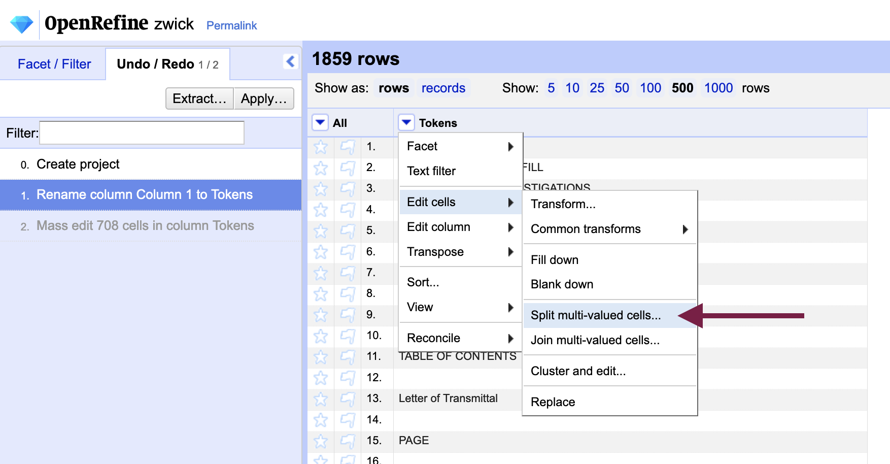

By default, the recommended separator character will be a comma (i.e. for comma-separated value, or CSV, files) - delete the comma and hit the space bar once to specify the space character as the separator. We are indicating to OpenRefine to split each cell every time it encounters a space in the text. Although we can think of cases in which a space does not indicate a new word, they will not matter for the purposes of OCR error correction. We will be putting the text back together again with the spaces restored when we have finished with error correction.  

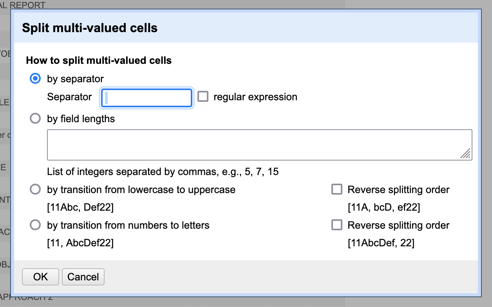

For now, we will leave in punctuation. Computational text analysis tools will typically remove the punctuation for us, and we may want the punctuation to remain if we are exporting a copy. Bear in mind that OpenRefine will view "bananas" and "bananas!" as two distinct entities, however.

After performing the split transformation, you should have many more rows as each word is now on its own line. You will also likely have a large number of blank rows again, however.

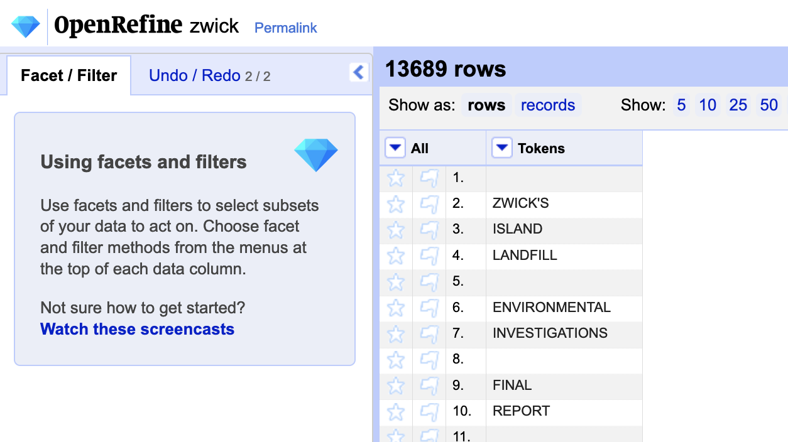

## OpenRefine step 4: Remove blank rows (and whitespaces, if applicable)

Blank rows are not relevant to our error correction tasks in OpenRefine and, as OpenRefine does have a ceiling on the number of rows it can work with, you may wish to delete them.

**To remove blank rows**, go to `Edit cells` > `Facet` > `Customized facets` > `Facet by blank (null or empty string)` in the column menu for "Tokens"; if you created paragraph placeholders in the previous step, you will be familiar with facets. 

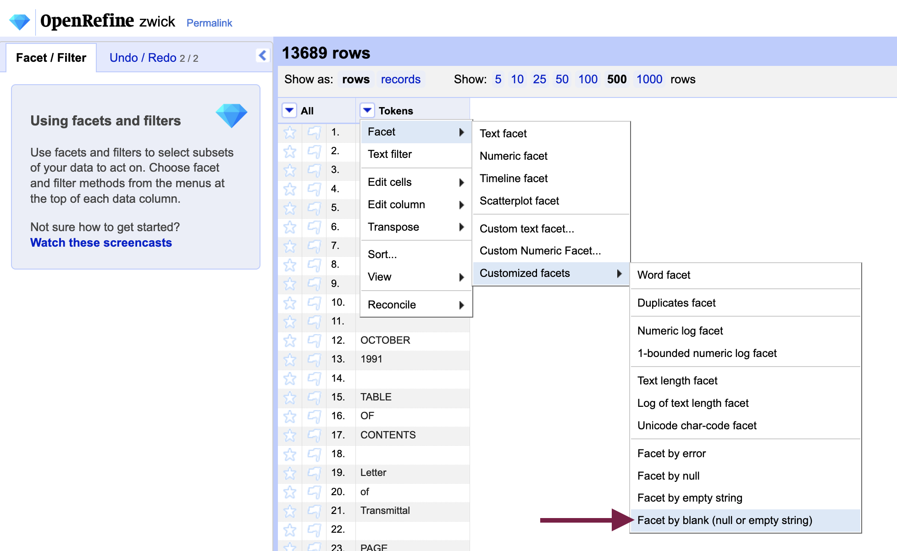

From the facet - or grouping of rows with the same contents - that is created, include “True” which temporarily exclude any cells that are not blank. 

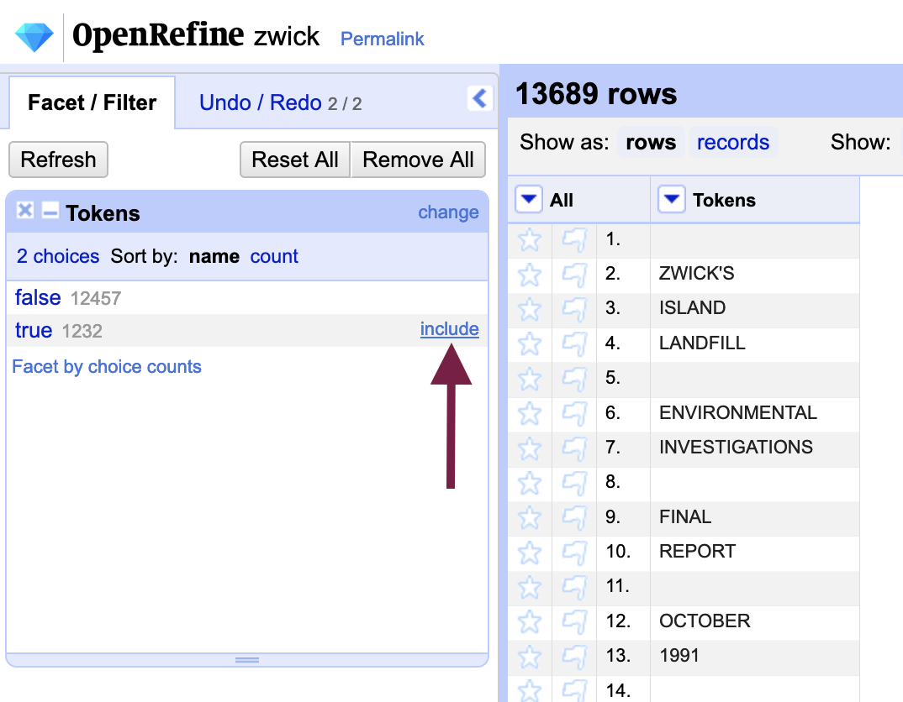

Star any one of the rows that remain (they will all be blank cells).

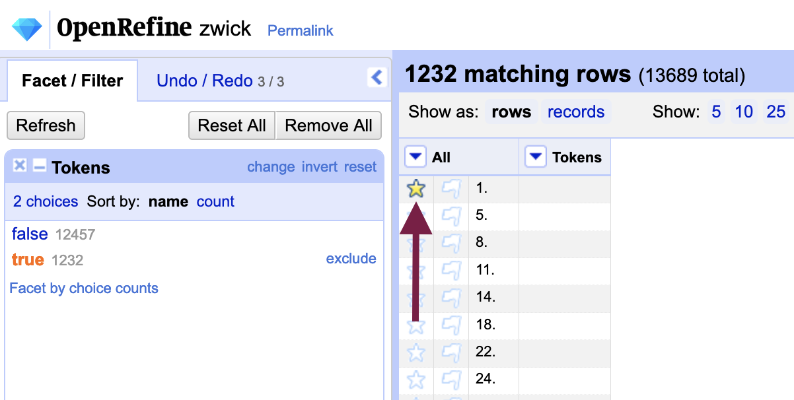

Next, instead of the "Tokens" column, we will use the menu in the "All" column to the left of it: `Edit rows` > `Remove matching rows`. All matching rows - that is, all blank rows - will be removed and the "True" facet will now contain zero results. Close the facet to remove it.

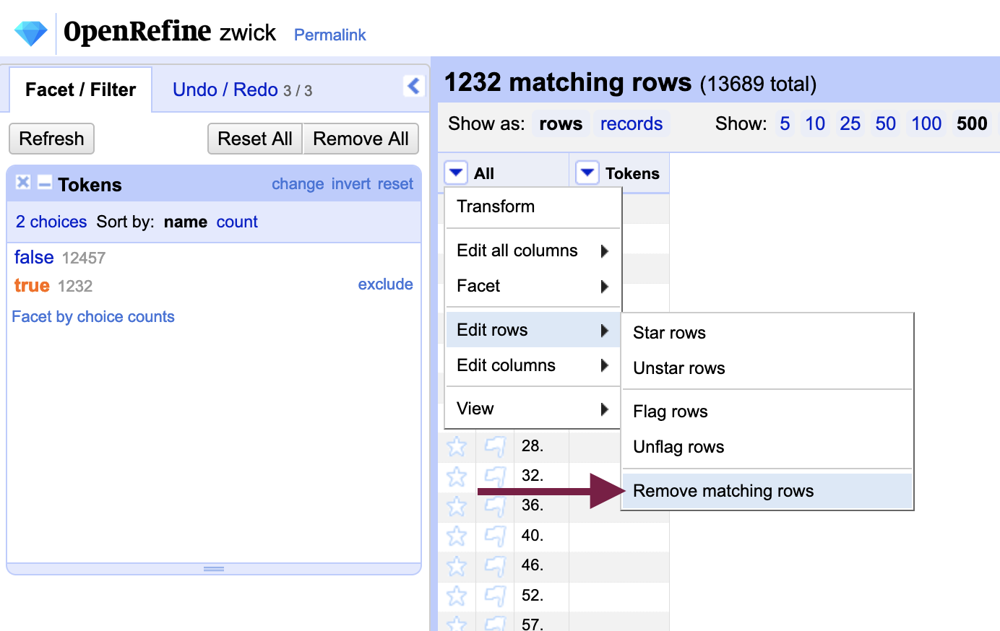

Much like punctuation, whitespaces in front of or behind a word will prevent it from being grouped with other instances of the same word in OpenRefine. We can easily remove them using the "Remove leading and trailing whitespaces" function.

**To remove whitespaces**, open the "Tokens" column menu from the previous step and select `Edit cells` > `Commons transforms` > `Trim leading and trailing whitespace`. Once you have done so, OpenRefine will report how many cells were transformed.

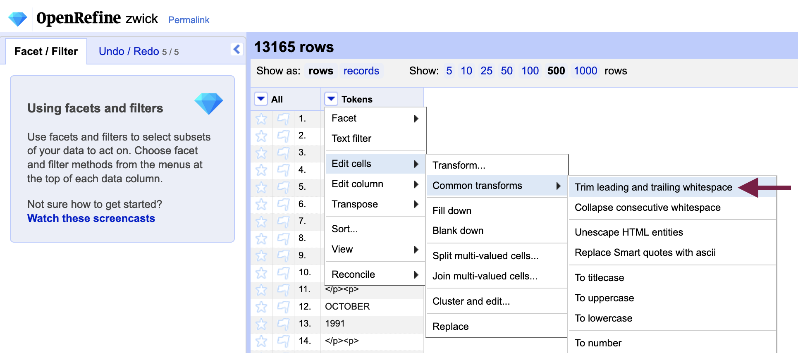

Because we have used spaces as the separator between rows, no rows are likely to be affected by removing leading and trailing whitespaces. It is nonetheless good practice to ensure that we are indeed comparing like with like, and you may find the feature useful with other datasets.

## OpenRefine step 5: Initial Data Analysis (again) with filters and facets

Once more with feeling! Now that we can perform operations at the level of the word, or token, we'll use OpenRefine to enrich our IDA. 

**Text filters** can be accessed from the "Tokens" column menu, which will help us to isolate results based on our earlier observations with the error list.

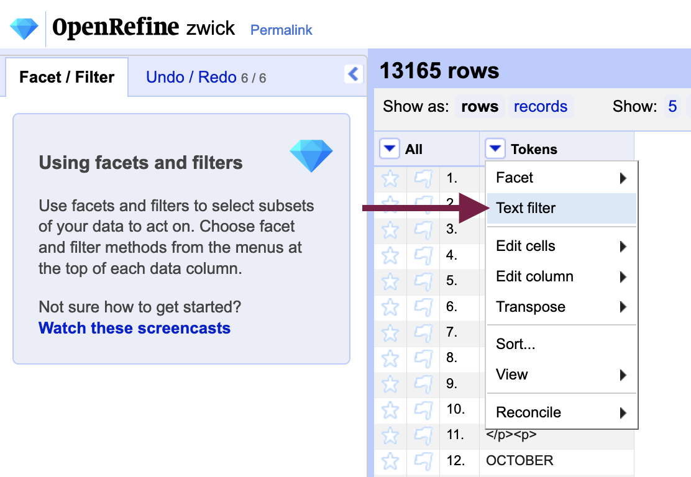

For example, many errors in the Zwick.txt document involved the letter "m" so you could filter result by *m* (with "case-sensitive" checked).

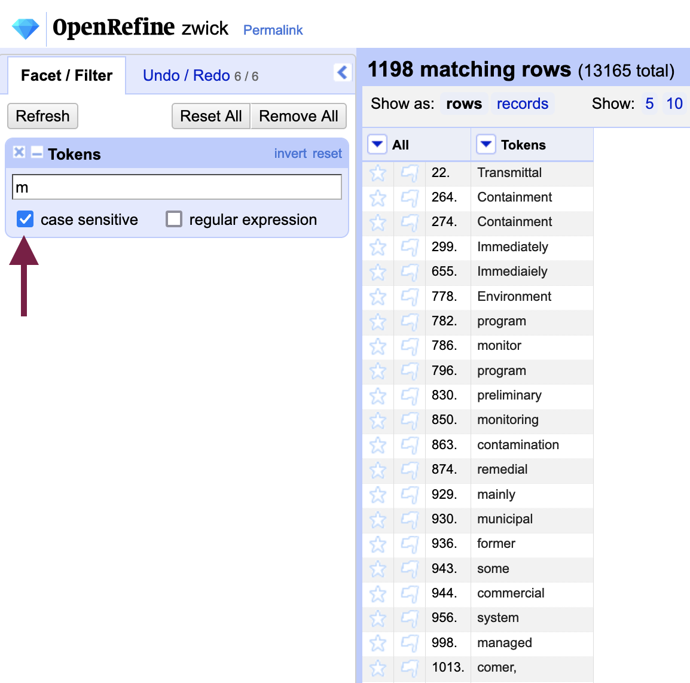

Such a broad search strategy can be narrowed by the use of facets, which we used previously when removing blank rows. Here we will use the `Word facet` (under `Customized facets`) or `Text facet` to group identical words together, shortening our list significantly.

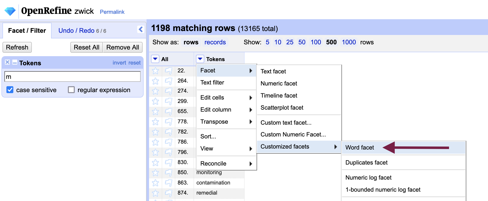

By now, you should have a good sense of the OCR errors in your dataset. Our next step will be to use OpenRefine to correct them!

 

Next -> [Correcting OCR Errors with OpenRefine: Strategies](or-strat.html)

