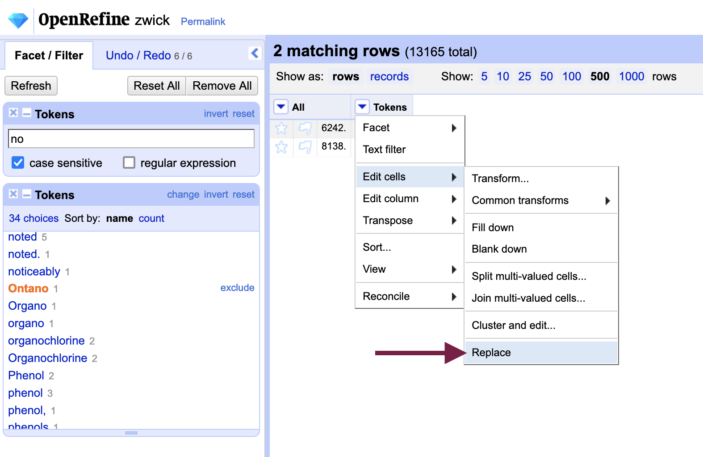
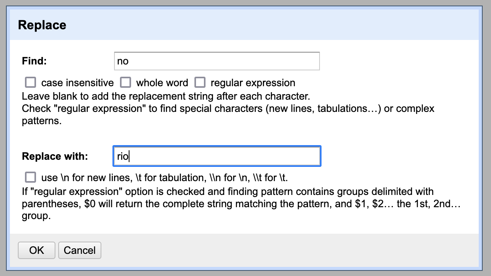
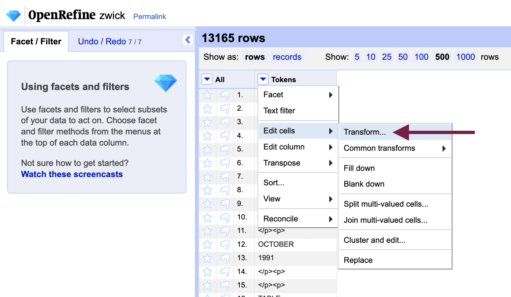
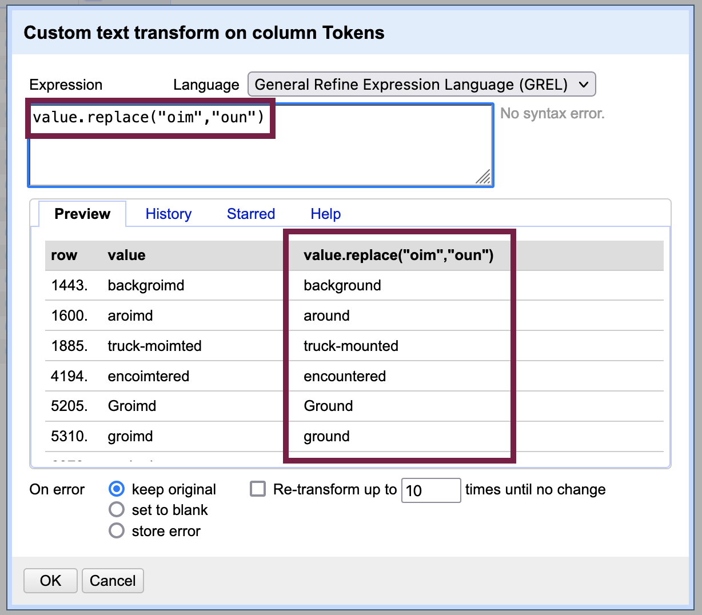
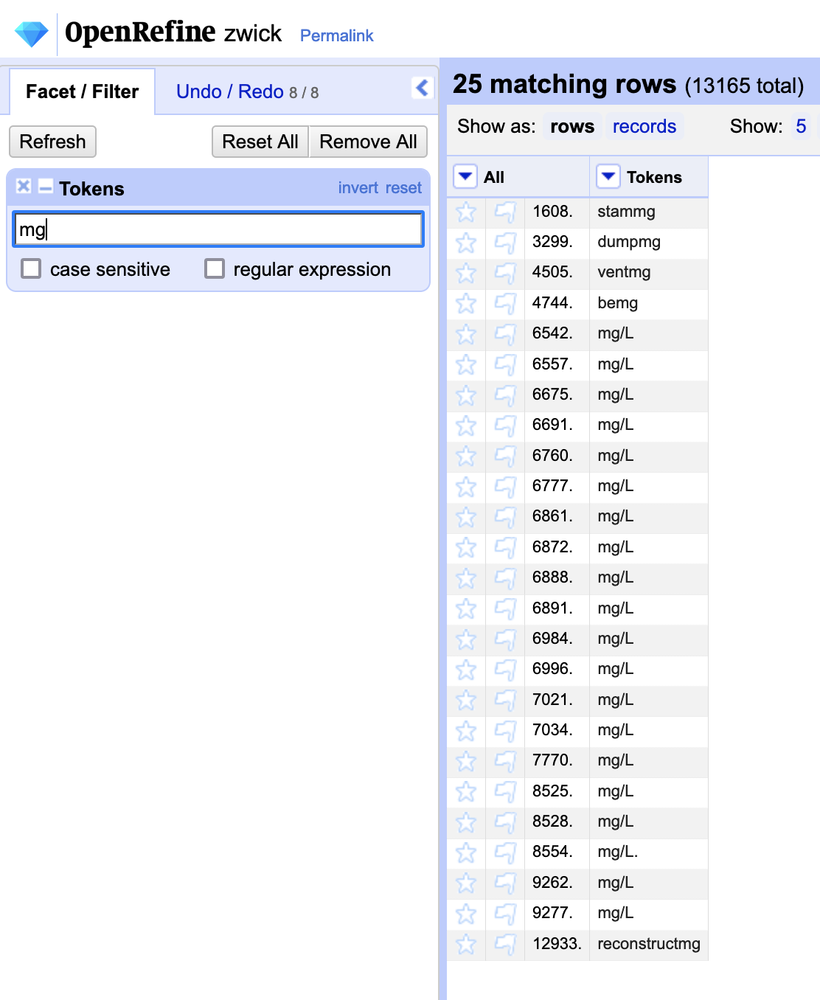
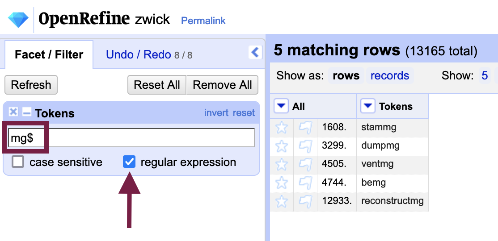

# 3. Correcting OCR Errors with OpenRefine: Strategies
 

<iframe id="kmsembed-1_xo1h3x4i" width="608" height="402" src="https://www.macvideo.ca/embed/secure/iframe/entryId/1_xo1h3x4i/uiConfId/39241881" class="kmsembed" allowfullscreen webkitallowfullscreen mozAllowFullScreen allow="autoplay *; fullscreen *; encrypted-media *" referrerPolicy="no-referrer-when-downgrade" sandbox="allow-forms allow-same-origin allow-scripts allow-top-navigation allow-pointer-lock allow-popups allow-modals allow-orientation-lock allow-popups-to-escape-sandbox allow-presentation allow-top-navigation-by-user-activation" frameborder="0" title="Kaltura Player" style="position:absolute;top:0;left:0;width:100%;height:100%"></iframe>

In the next part of the lesson, we will explore severals strategies you can use in OpenRefine to correct errors produced through optical character recognition more efficiently than replacing individual words. Together, they form the basis for a unique error correction program that OpenRefine helps you to write - as we will learn in [Exporting your Data](output.html). 

Though still a manual process of creating find-and-replace commands, the corrections you make are likely to be (far) more accurate than a machine learning approach (for the time being).

Jump to step >

[3.1. Find-and-replace with text filters](l#31-find-and-replace-with-text-filters)

[3.2. Find-and-replace with GREL (Google / General Refine Expression Language)](#32-find-and-replace-with-grel-google--general-refine-expression-language)

[3.3. Find-and-replace with regular expressions (RegEx)](#33-find-and-replace-with-regular-expressions-regex)

## **3.1.** Find-and-replace with text filters
 

<iframe id="kmsembed-1_8f8gstrm" width="608" height="402" src="https://www.macvideo.ca/embed/secure/iframe/entryId/1_8f8gstrm/uiConfId/39241881" class="kmsembed" allowfullscreen webkitallowfullscreen mozAllowFullScreen allow="autoplay *; fullscreen *; encrypted-media *" referrerPolicy="no-referrer-when-downgrade" sandbox="allow-forms allow-same-origin allow-scripts allow-top-navigation allow-pointer-lock allow-popups allow-modals allow-orientation-lock allow-popups-to-escape-sandbox allow-presentation allow-top-navigation-by-user-activation" frameborder="0" title="Kaltura Player" style="position:absolute;top:0;left:0;width:100%;height:100%"></iframe>

Find-and-replace is at the heart of the other OCR error correction strategies discussed in the lesson. While find-and-replace commands can automate error correction to some extent, it can also lead to the introduction of new errors if not applied precisely. Text filters in OpenRefine allow us to apply find-and-replace transformations in a targeted manner. 

We used text filters for initial data analysis in OpenRefine; here, we will employ them to limit the scope of our transformations.

Try it out by going to the "Tokens" column menu, selecting `Text filter` and searching "no" (with case-sensitive checked). Create a word facet to group your results.

Include "Ontano" and "vanous" to omit the other results, which are not misspelled. From the "Tokens" column menu again, select `Edit cells` > `Replace` to open a dialog box. 

Type "no" in "Find: " and "rio" in "Replace: " - we use "no" instead of "n" because our actions would transform "Ontano" into "Oritario." 

Before working through your error list with "Replace," however, there is an alternative - and arguably better - approach. If you notice that you have made an error, you can easily undo it by going to the "Undo / Redo" tab 
Read on...

## **3.2** Find-and-replace with GREL (Google / General Refine Expression Language)
 

<iframe id="kmsembed-1_4df746o0" width="608" height="402" src="https://www.macvideo.ca/embed/secure/iframe/entryId/1_4df746o0/uiConfId/39241881" class="kmsembed" allowfullscreen webkitallowfullscreen mozAllowFullScreen allow="autoplay *; fullscreen *; encrypted-media *" referrerPolicy="no-referrer-when-downgrade" sandbox="allow-forms allow-same-origin allow-scripts allow-top-navigation allow-pointer-lock allow-popups allow-modals allow-orientation-lock allow-popups-to-escape-sandbox allow-presentation allow-top-navigation-by-user-activation" frameborder="0" title="Kaltura Player" style="position:absolute;top:0;left:0;width:100%;height:100%"></iframe>

Performing find-and-replace tasks with GREL, or General Refine Expression Language, allows us to use variables and create formulas - we can correct more errors at once while at the same time not being overly broad in the scope of our transformations. Going the GREL route is a preferred strategy to the “replace” command in OpenRefine because you can preview your changes before you apply them.

To use GREL in OpenRefine, go to the "Tokens" column menu and select `Edit cells` > `Transform` to open the custom text transform box that gives us access to the GREL language. We will use the function `value.replace(a, b)` in the “Expression” box to apply a replace transformation, where *a* is what to replace and *b* is what to replace it with.

As in our earlier replace actions, start by filtering rows to limit the extent of our transformations. Practice with “oim” - which we know has replaced “oun” in numerous words.

In the custom text transform box, type `value.replace(“oim”, “oun”)` exactly - remember to include the quotations marks around the letters to indicate that we are working with text strings and not numbers or other data types. A preview will show you the results of your transformation. 

After you have applied the tranformation, OpenRefine will notify you that 15 rows have been changed and you should no longer have any rows visible (because they will no longer contain "oim"). You can either close the filter to remove it or clear its contents to return all rows.

There are other functions that might be useful to your OCR error correction efforts if you would like to read over the [reference for GREL](https://docs.openrefine.org/manual/grelfunctions) in greater depth.

## **3.3** Find-and-replace with regular expressions (RegEx)
 

<iframe id="kmsembed-1_eb68oxh5" width="608" height="402" src="https://www.macvideo.ca/embed/secure/iframe/entryId/1_eb68oxh5/uiConfId/39241881" class="kmsembed" allowfullscreen webkitallowfullscreen mozAllowFullScreen allow="autoplay *; fullscreen *; encrypted-media *" referrerPolicy="no-referrer-when-downgrade" sandbox="allow-forms allow-same-origin allow-scripts allow-top-navigation allow-pointer-lock allow-popups allow-modals allow-orientation-lock allow-popups-to-escape-sandbox allow-presentation allow-top-navigation-by-user-activation" frameborder="0" title="Kaltura Player" style="position:absolute;top:0;left:0;width:100%;height:100%"></iframe>

We can build on our find-and-replace toolkit by incorporating regular expressions, or RegEx, which offer a way to search for more generalized patterns when we may not know or be able to articulate specifics. For example, performing a search that all results ending in “mg” regardless of what comes before. 

Combined with GREL transformations, filters and facets, we can achieve a balance between speeding up our OCR error efforts while not being so inclusive that we introduce new errors.

To get a sense of RegEx in OpenRefine, create a text filter with "mg" as the criteria to find words where "ing" has been misinterpreted by the OCR engine. Note that, in addition to the words we would like to change, there are a number of correctly spelled results (i.e. "mg/L").

To limit the scope to rows (words) that end in "mg" we can use the regular expression "$mg" as the filter criteria, ensuring that the "regular expression" box is checked. We can now proceed with our text transformation without affecting correctly spelled words.

### Quick RegEx Reference

Other RegEx patterns you might find useful to your OCR error correction efforts include: 

`^` - start of expression 
`$` - end of expression

E.g.  
`^T$` will only return cells with “T” 
`^mn` will only return cells that start with “mn” 
`ent$` will only return cells that end with “ent” 

`[string]` - contains any of the letters 
`[^string]` - does not contain the letters

E.g.  
`[iou]m` will return words that contain “im,” “om” and “um” 
`ti[^o]` will exclude “tion”

Familiarity with RegEx will improve your ability to correct OCR errors in OpenRefine considerably; you can seek out other patterns by consulting RegEx references like the [Mozilla RegEx cheatsheet](https://developer.mozilla.org/en-US/docs/Web/JavaScript/Guide/Regular_Expressions/Cheatsheet) or [RegEx One tutorials](https://regexone.com/).

## Try it with your own data...

By now, you can likely appreciate how the specific transformations we have made on the Zwick.txt dataset are highly context-dependent. Each corpus will entail a unique set of tranformations to correct the OCR errors within.

With your own dataset, try out the strategies above to correct 5 to 10 error patterns in your corpus before moving on to the next step of the lesson wherein we will export our data from OpenRefine to a text format.

 

Next --> [Exporting your Data](output.html)
